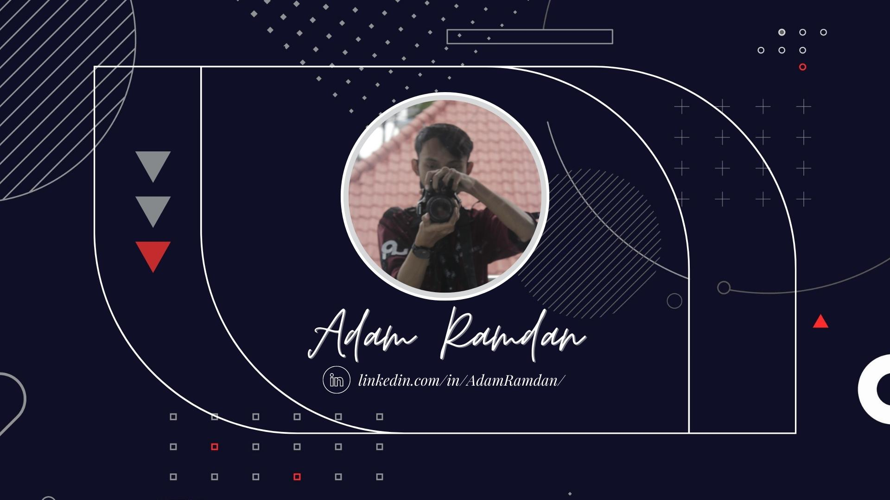

  

 

&nbsp;
&nbsp;
&nbsp;
&nbsp;

## Adam Ramdan &nbsp;
I am a Web Developer and Graphic Designer. I live in Indonesia and I am registered as an Informatics Engineering student at the Muhammadiyah University of Sukabumi in 2020.

## About Me 
I aspire to be web or game development. I am a person who is very enthusiastic about all things programming and always feels challenged to learn and work on projects, both web-based and mobile-based, besides that I am also active in various organizations on campus.

My hobbies are quite a lot, I like photography, design and editing. Besides that, to relieve fatigue and stress, I usually play games or read comics.

- 😆 I'm interested in Game Development, Web Development, and Machine Learning
- 📧 Contact me for something on arshinks12@gmail.com

> **"It's not impossible but you can't or don't know how"**

## Sosial Media

## Tech & Tools
#### ▶ Programming
 &nbsp;
 &nbsp;
 &nbsp;
 &nbsp;
 &nbsp;
 &nbsp;
 &nbsp;
 &nbsp;
 &nbsp;
 &nbsp;
 &nbsp;
 &nbsp;
 &nbsp;
 &nbsp;
 &nbsp;
 
 #### ▶ Photo & Editing
 &nbsp;
 &nbsp;
 &nbsp;
 &nbsp;
 &nbsp;
 &nbsp;
 
 ## Github Stats 
 

 

 

 

<h1>~Thank you for coming~ 😆</h1>

